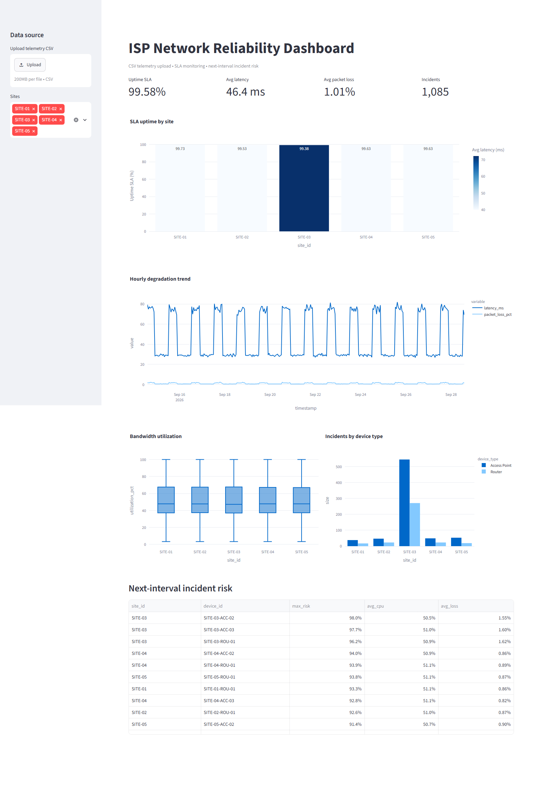

# Network Performance Analytics Dashboard

End-to-end ISP network observability and predictive analytics project. It turns synthetic 15-minute telemetry into SLA metrics, degradation trends, and next-interval incident risk.

> Dataset is synthetic. No client names, private IPs, credentials, or production telemetry are included.

## What this demonstrates

- Reproducible telemetry generation with controlled site degradation and peak-hour effects
- SQLite data pipeline with parameterized site filtering
- SLA, latency, packet-loss, bandwidth, and incident analytics
- Time-ordered Random Forest classification for next-interval incident risk
- Streamlit + Plotly dashboard
- Unit tests, lint gate, and GitHub Actions CI

## Dashboard preview



*Captured from the Streamlit app running on the synthetic dataset (20,175 records across 5 sites and 15 devices).*

What the screenshot shows:

| Area | Description |
|---|---|
| **Sidebar — Data source** | `Upload telemetry CSV` control for importing your own dataset, plus a multi-select site filter |
| **KPI row** | Uptime SLA 99.58%, average latency 46.4 ms, average packet loss 1.01%, and 1,085 incident intervals |
| **SLA uptime by site** | Bar chart of per-site uptime, colored by average latency; SITE-03 is the lowest at 99.38% |
| **Hourly degradation trend** | Two-week view of latency and packet-loss movement, showing the daily peak-hour cycle |
| **Bandwidth utilization** | Box plot of utilization distribution per site, with medians near 50% and upper whiskers reaching capacity |
| **Incidents by device type** | Grouped bars comparing Access Point vs Router incidents; SITE-03 dominates both |
| **Next-interval incident risk** | Top-10 risk table sorted by predicted probability; SITE-03 devices lead at up to 98.0% |

## Repository

```text
network-performance-analytics/
├── .github/workflows/ci.yml
├── data/                         # generated locally; raw CSV and SQLite ignored
├── dashboard/app.py
├── docs/
│   └── dashboard_overview.png    # README screenshot
├── notebooks/exploratory_analysis.ipynb
├── scripts/capture_screenshot.py
├── src/
│   ├── analytics.py
│   ├── database.py
│   ├── data_generator.py
│   └── ml_model.py
├── tests/
├── requirements.txt
└── README.md
```

## Quickstart

```bash
python -m venv .venv
# Windows
.venv\Scripts\activate
# macOS/Linux
source .venv/bin/activate

pip install -r requirements.txt
python src/data_generator.py
python src/database.py
python src/ml_model.py
pytest -q
streamlit run dashboard/app.py
```

Open the URL printed by Streamlit.

To regenerate the README screenshot while the app is running:

```bash
pip install playwright
playwright install chromium
python scripts/capture_screenshot.py   # writes docs/dashboard_overview.png
```

## Uploading your own telemetry

The dashboard sidebar has a **Upload telemetry CSV** control. It accepts a CSV with the columns listed under Data model, validates the schema, backs up the previous dataset, rebuilds SQLite, and retrains the risk model. The dataset is stored locally and is not committed to Git.

This is a manual import, not a live feed. Real-time telemetry needs a collector (SNMP, MikroTik/UniFi API, Prometheus, NetFlow, or syslog) plus a scheduled refresh.

## Data model

| Column | Meaning |
|---|---|
| `timestamp` | 15-minute telemetry timestamp |
| `site_id` / `device_id` | Synthetic location and device IDs |
| `uptime_status` | 1 online, 0 offline |
| `latency_ms` | Average latency |
| `packet_loss_pct` | Packet loss percentage |
| `bandwidth_usage_mbps` | Current usage |
| `bandwidth_capacity_mbps` | Link/device capacity |
| `cpu_utilization_pct` | Device CPU utilization |
| `is_incident` | Current interval incident label |

## ML design

The model predicts `target_next_incident`, created by shifting each device's incident label one interval forward. Features do not include the current incident label. Training uses the first 80% of time-ordered rows; the final 20% is the test set. This avoids random temporal leakage.

Metrics printed by `python src/ml_model.py` are generated from the current synthetic seed and can change when the generator changes.

## Business questions

- Which sites miss the uptime target?
- Does peak-hour utilization coincide with latency and packet-loss degradation?
- Which devices have the highest predicted risk in the next interval?
- Should operations prioritize capacity, physical inspection, or failover work?

## CI

GitHub Actions runs data generation, SQLite loading, model training, flake8 syntax checks, and pytest on every push and pull request to `main`.

## Limitations

Synthetic labels are rule-based, so model performance is not evidence of production predictive power. Production use needs real telemetry, incident timestamps, missing-data handling, class-drift monitoring, alert calibration, and a documented SLA definition.

## License

MIT
